# Data Structures and Algorithms 

[](https://travis-ci.com/justeban/data-structures-and-algorithms)

*Whiteboard Challenges for Code Fellows seattle401d24*

### Table of contents

  * [Array Data Structure Modules](#array-data-structure-modules)
    * [Challenge 1 Reverse Array](#reverse-array)
    * [Challenge 2 - Insert and Shift Array](#insert-shift-array)
    * [Challenge 3 - Array Binary Search](#binary-search)
    * [Challenge 4 - Largest Adjacent Product](#adjacent-product)
  * [Linked List Data Structure Modules](#linked-list)
    * [Linked List Module Docs](#linked-list-help)
    * [Linked List Methods](#linked-list-methods)
      * [```append(value)```](#ll-append)
      * [```prepend(value)```](#ll-prepend)
      * [```reverse()```](#ll-reverse)
      * [```remove(offset)```](#ll-remove)
      * [```serialize()```](#ll-serialize)
      * [```deserialize(data)```](#ll-deserialize)
    * [Challenges](#ll-challenges)
      * [Linked List Insertions](#ll-challenge1)  
      * [Kth From End](#ll-challenge2)  
      * [Linked List Merge](#ll-challenge3)
      * [Detect Loop](#ll-challenge4)
  * [Stacks and Queues](#stacks-queues)
    * [Stacks and Queue Docs](#stacks-queues)
    * [Stack Methods](#stack-methods)
      * [```push()```](#stack-push)
      * [```pop()```](#stack-pop)
      * [```serialize()```](#stack-serialize)
      * [```deserailize()```](#stack-deserialize)
    * [Queue Methods](#queue-methods)
      * [```enqueue()```](#queue-enqueue)
      * [```dequeue()```](#queue-dequeue)
      * [```serialize()```](#queue-serialize)
      * [```deserailize()```](#queue-deserialize)
    * [Challenges](#stacks-queues-challenges)
      * [Challenge 1 - Queues With Stacks](#stacks-queues-challenge1)
      * [Challenge 2 - FIFO Animal Shelter](#stacks-queues-challenge2)
      * [Challenge 3 - Multi Bracket Validation](#stacks-queues-challenge3)
      * [Challenge 4 - Towers of Hanoi](#stacks-queues-challenge4)
  * [Binary Trees](#binary-trees)
    * [Challenges](#tree-challenges)
      * [Challenge 01 - FizzBuzz Tree](#tree-challenge1)
      * [Challenge 02 - Breadth First Traversal](#tree-challenge2)

<a id="array-data-structure-modules"></a>

Array Data Structure Modules
=====================

<a id="reverse-array"></a>

### Challenege 1 - Reverse Array 


#### Challenge
Write a function called reverseArray which takes an array as an argument. Without utilizing any of the built-in methods available to your language, return the provided array argument with elements in reversed order.

#### Solution
*[Solution 1](https://github.com/justeban/data-structures-and-algorithms/blob/array_reverse/array_reverse.js/#L3)* - *[Solution 2](https://github.com/justeban/data-structures-and-algorithms/blob/array_reverse/array_reverse.js/#L16)*

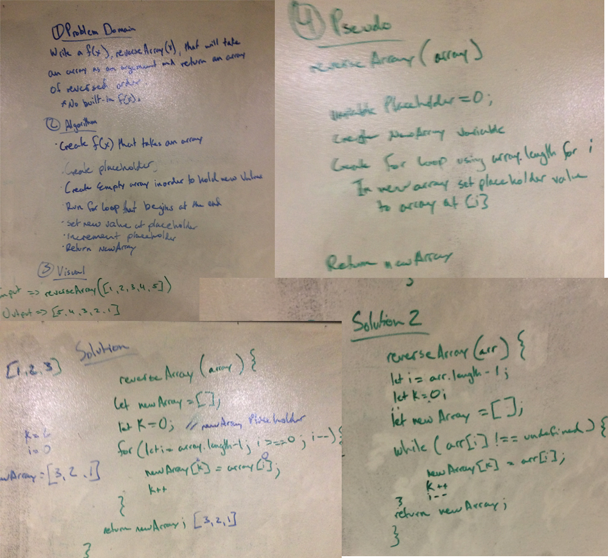

<a id="insert-shift-array"></a>

### Challenege 2 - Insert and Shift Array

#### Challenge
Write a function called ```insertShiftArray``` which takes in an array and the value to be added. Without utilizing any of the built-in methods available to your language, return an array with the new value added at the middle index.

#### Solution
*[Solution](https://github.com/justeban/data-structures-and-algorithms/blob/array_shift/array_shift.js/#L1)*


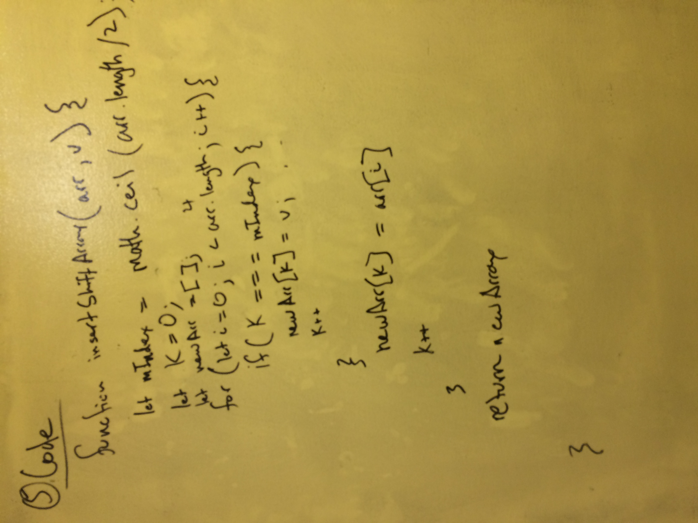

<a id="binary-search"></a>

### Challenge 3 - Array Binary Search 

#### Challenge 

Write a function called ```BinarySearch``` which takes in 2 parameters: a sorted array and the search key. Without utilizing any of the built-in methods available to your language, return the index of the array’s element that is equal to the search key, or -1 if the element does not exist.

#### Solution

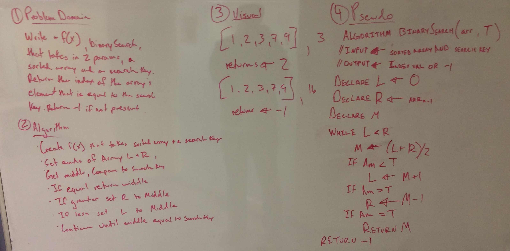
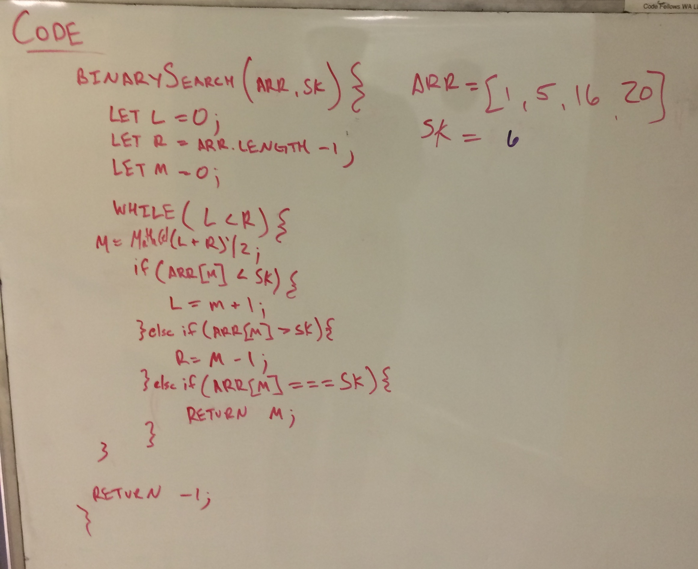


<a id="adjacent-product"></a>

### Challenge 4 - Largest Adjacent Product

#### Challenge 

Write a function called ```largestProduct``` which takes in a 2D array. Without utilizing any of the built-in methods available to your language, return the largest product of 2 adjacent values within the 2D array.

#### Solution

[Link to Code](https://github.com/justeban/data-structures-and-algorithms/blob/master/lib/array-data-structures/array_adjacent_product.js)

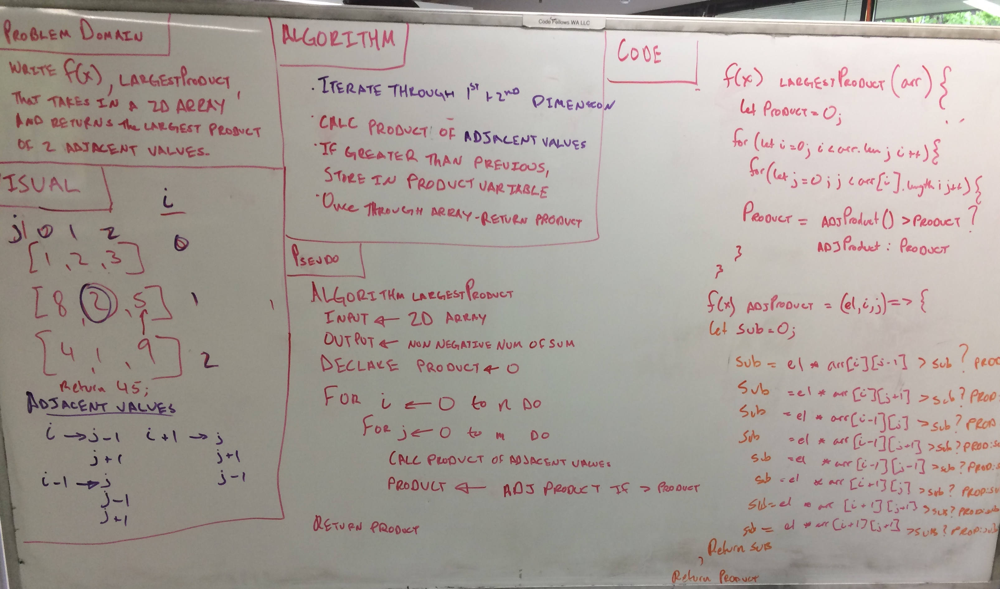

<a id="linked-list"></a>

Linked List
============
<a id="linked-list-help"></a>

### Documentation

This ```Linked List ``` module is contained in the ```./lib/linked-lists/``` directory. This module makes use of, and requires two files - ```linked_list.js``` and ```node.js```.

```node.js``` contains a Node constructor and ```linked_list.js``` contains the linked list constructor and the methods available to the linked list. 

In order to use you'll need to require in only ```linked_list.js```.

```
const LL = require('./lib/linked_list.js');
```
We can then use the module. In order to create a new linked list: 

```let list = new  LL()```

This creates a linked list with a head value of ```null```.

<a id="linked-list-methods"></a>
We can now use the methods made available: 

* [```append(value)```](#ll-append)
* [```prepend(value)```](#ll-prepend)
* [```reverse()```](#ll-reverse)
* [```remove(offset)```](#ll-remove)
* [```serialize()```](#ll-serialize)
* [```deserialize(data)```](#ll-deserialize)

<a id="ll-append"></a>
```append(value)```
=============

```append(value)``` will take any value, create a Node, and attach the Node to the end of your list. If it is the first item, it will become the head of your list and ```list.head.value``` will equal whatever value you place as the parameter.

```
let list = new LL();

list.append('First Thing');

list.append('Second Thing');
```
The append works by creating a node with two properties: ```value``` and ```next```. ```value``` becomes whatever value you place in the parameter and ```next``` equals ```null```.

Our list now looks like this: 
```
LinkedList {
  head:
   Node {
     value: 'First Thing',
     next: Node { value: 'Second Thing', next: null } } }
```
If ```append()``` is given no value as a parameter an error will be thrown. 

<a id="ll-prepend"></a>
```prepend(value)```
===================

The ```prepend(value)``` method works similar to ```append()``` method except that it places the new Node at the beginning of your list replacing the ```head``` with whatever value you assign. 

```
let thirdValue = 'Third Thing';

list.prepend(thirdValue);
```
Results to: 
```
LinkedList {
  head:
   Node {
     value: 'Third Thing',
     next: Node { value: 'First One', next: [Node] } } }
```
```prepend()``` can be given any value be left empty an error will be thrown.

<a id="ll-reverse"></a>
```reverse()```
===================

```reverse``` will reverse the order of the link list you create. 

``` 
let list = new LL();

list.append('First Thing');

list.append('Second Thing');

list.reverse();
```
```list``` now equals: 
```
LinkedList {
  head:
   Node {
     value: 'Second Thing',
     next: Node { value: 'First Thing', next: null } } }
```
<a id="ll-remove"></a>
```remove(offset)```
===================

```remove(offset)``` works by taking in an ```offset```, which is a number, and removes the item at that place in the list. The ```offset``` is zero-based much like an array index.

For example, ```remove(0)``` will remove the first item, ```remove(1)``` will remove the second and so on.

Let's see it: 

```
let list = new LL();

list.append('First Thing');

list.append('Second Thing');

```

```list.remove(0)``` will remove ```'First Thing'``` from the list and make ```'Second Thing'``` the head. 

```
list.remove(0)

// LinkedList { head: Node { value: 'Second Thing', next: null } }

```
If we have a list with multiple nodes, ```remove(offset)``` will remove the item at that offset.

```
let list = new LL();

list.append('First Thing');

list.append('Second Thing');

list.append('Third Thing');

list.remove(1);
```
Our list will now look like: 
```
LinkedList {
  head:
   Node {
     value: 'First Thing',
     next: Node { value: 'Third Thing', next: null } } }
```
If ```remove(offset)``` is given an offset value that is not a number, a number less than 0 or a number that is greater than the length of the list, an error will be thrown.

<a id="ll-serialize"></a>
```serialize()```
===================

The ```serialize()``` method creates a JSON-valid Object that only holds the values of each node in an array. 

If we have a list:
```
let list = new LL();

list.append('First Thing');
list.append('Second Thing');
list.append('Third Thing');

let JSONdata = list.serialize();
```
```JSONdata``` looks like: 
```
["First Thing","Second Thing","Third Thing"]
```
<a id="ll-deserialize"></a>
```deserialize(data)```
===================

The ```deserialize(data)``` method will take any JSON-valid data and input that data into your linked list. 

It is a method so you must create a new instance of the list module and pass into the parameter your serialized data. 
```
let list = new LL();

let data = "[\"First Thing\", \"Second Thing\", \"Third Thing\", \"Fourth Thing\", \"Fifth Thing\"]";

list.deserialize(data)
```
Our list now looks like this: 
```
LinkedList {
  head:
   Node {
     value: 'First Thing',
     next: Node { value: 'Second Thing', next: [Node] } } }
     
  ```
<a id="ll-challenges"></a>

Challenges
=========

<a id="ll-challenge1"></a>

### Challenge 1 - Linked List Insertions

#### Challenge

Write the following methods for the Linked List class:

* ```.append(value)``` which adds a new node with the given value to the end of the list
* ```.insertBefore(value, newVal)``` which add a new node with the given newValue immediately before the first value node
* ```.insertAfter(value, newVal)``` which add a new node with the given newValue immediately after the first value node

#### Solution

[*Coded Solution*](https://github.com/justeban/data-structures-and-algorithms/blob/master/lib/linkded-lists/challenge_01/ll.js) 

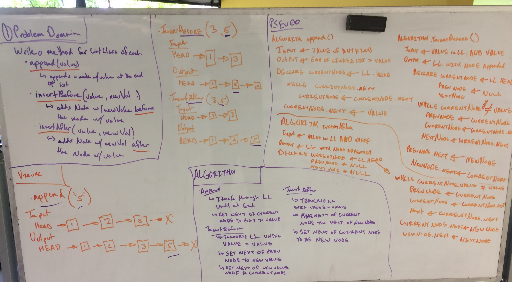

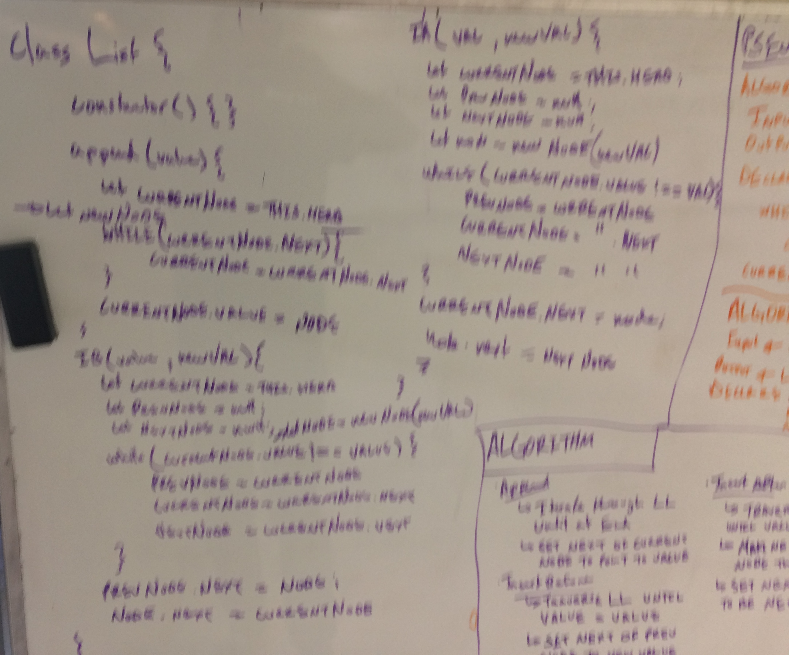

<a id="ll-challenge2"></a>
======

### Challenge 2 - Kth From End Method

#### Challenge

Write a method for the Linked List class which takes a number, k, as a parameter. Return the node that is k from the end of the linked list. You have access to the Node class and all the properties on the Linked List class as well as the methods created in previous challenges.

#### Solution

[*Coded Solution*](https://github.com/justeban/data-structures-and-algorithms/blob/master/lib/linkded-lists/challenge_02/ll_kth_from_end.js) 

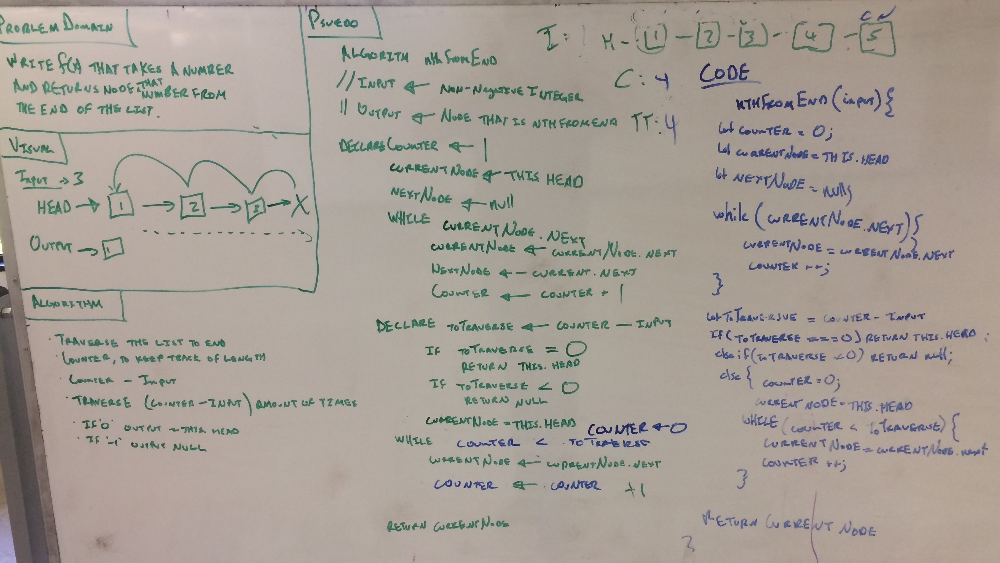

<a id="ll-challenge3"></a>
======

### Challenge 3 - Merge Two Linked Lists

*File located at ```'./lib/linked-lists/challenge_03/ll_merge.js'```*

*Requires methods from ```'./lib/linked-lists/linked_list.js'```

#### Challenge

Write a function called mergeLists which takes two linked lists as arguments. Zip the two linked lists together into one so that the nodes alternate between the two lists and return a reference to the head of the single list. Try and keep additional space down to O(1). You have access to the Node class and all the properties on the Linked List class as well as the methods created in previous challenges.

#### Solution

[*Coded Solution*](https://github.com/justeban/data-structures-and-algorithms/blob/master/lib/linkded-lists/challenge_03/ll_merge.js) 

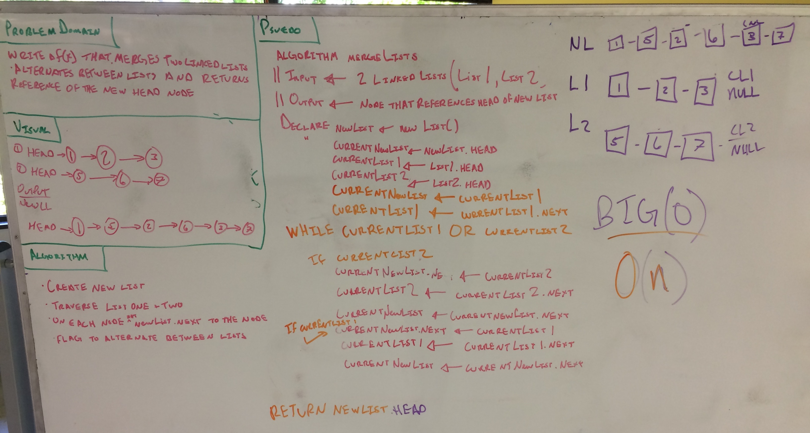

<a id="ll-challenge4"></a>
======

### Challenge 4 - Detect Loop

*File located at ```'./lib/linked-lists/challenge_04/ll_detect_loop.js'```*

*Requires methods from ```'./lib/linked-lists/linked_list.js'```

#### Challenge

Write a method called hasLoop that returns a boolean and determines whether or not a linked list has a loop or not. Will return true if linked list does have a loop and false if it doesn't. One of the goals was to not use any extra memory as we create this mehtod. 

#### Solution

[*Coded Solution*](https://github.com/justeban/data-structures-and-algorithms/blob/master/lib/linkded-lists/challenge_04/ll_detect_loop.js) 

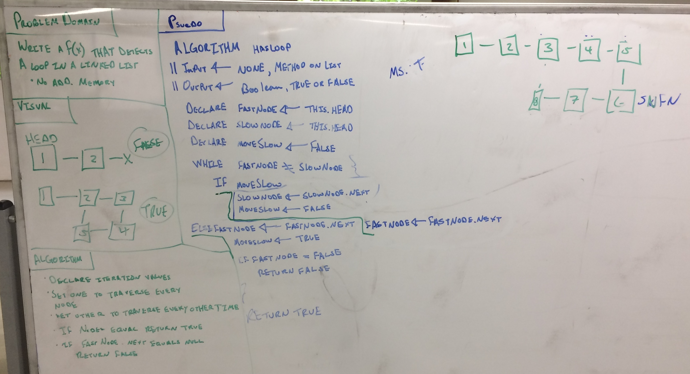

<a id="stacks-queues"></a>

Stacks and Queues
=================

## Stacks
### Documentation

This ```Stacks``` module is contained in the ```./lib/stacks-and-queues/stack.js```. 

This Stack Data Structure contains a constructor that is made up of a ```stack``` property that holds data. 

<a id="stack-methods"></a>
This module for the ```Stack``` Data Structure utilizes the follwoing methods: 
  * [```push()```](#stack-push)
  * [```pop()```](#stack-pop)
  * [```serialize()```](#stack-serialize)
  * [```deserailize()```](#stack-deserialize)

  <a id="stack-push"></a>

```push(value)```
===============

This ```push()``` method complies by the stack's LIFO (Last In First Out) manner. 

When using the push method, it will push the value to the top of the stack.

```
let stack = new Stack();

stack.push(1);
stack.push(2);
stack.push(3);

console.log(stack) // {stack: [3,2,1]}
```
You can also chain pushes together. 
```
let stack = new Stack();

stack.push(1).push(2).push(3);
```

<a id="stack-pop"></a>

```pop()```
===========
This ```pop()``` method will return next the value in the stack and also modify that stack itself.

```
let stack = new Stack();

stack.push(1).push(2).push(3);

let returned = stack.pop();

console.log(returned, stack) // 3, {stack: [2,1]}
```
<a id="stack-serialize"></a>

```serialize()```
==================

This ```serialize()``` method will return a JSON-valid object representing the data of the stack.

```
let stack = new Stack();

stack.push('Apple').push('Orange').push('Pear');

let data = stack.serialize();
cosnole.log(data) // "["Pear", "Orange", "Apple"]"
```
<a id="stack-deserialize"></a>

```deserialize(value)```
=================

In order to turn your data into a valid stack, you can use the ```deserialize()``` method. 
```
let data = "["Apple", "Pear", "Orange"];

stack.deserialize(data);

console.log(stack); // {stack: ['Apple', 'Pear', 'Orange']}
```
## Queues
### Documentation

This ```queue``` module is contained in the ```./lib/stacks-and-queues/queue.js```. 

This Queue Data Structure contains a constructor that is made up of a ```queue``` property that holds data. 

<a id="queue-methods"></a>

This module for the ```Queue``` Data Structure utilizes the follwoing methods: 
  * [```enqueue()```](#queue-enqueue)
  * [```dequeue()```](#queue-dequeue)
  * [```serialize()```](#queue-serialize)
  * [```deserailize()```](#queue-deserialize)

  <a id="queue-enqueue"></a>

  ```enqueue(value)```
  =====================

  Thid ```enqueue``` method places the value next in the queue. This queue complies by the FIFO (First In First Out) standard. 

  ```
  let queue = new Queue;
  queue.enqueue('A').enqueue('B').enqueue('C');

  console.log(queue) // {queue: ['A', 'B', 'C']}
  ```
  *note that the enqueue and dequeue method can be changed together*
  
  <a id="queue-dequeue"></a>

  ```dequeue()```
  =================
  The ```dequeue``` method will remove the next value in the queue.

``` 
let queue = new Queue;
  queue.enqueue('A').enqueue('B').enqueue('C');

  let returned = queue.dequeue();
  console.log(returned, queue); // 'A', {queue: 'B', 'C'}

  ```

  <a id="queue-serialize"></a>

  ```serialize()```
  ============
  The ```serialize()``` method doesn't take any paramter values. It returns a JSON-valid string that represents that data of the queue.

  ``` 
  let queue = new Queue;
  queue.enqueue('A').enqueue('B').enqueue('C');

  let data = queue.serialize();

  console.log(data) // "["A", "B", "C"]"
  ```

  <a id="queue-deserialize"></a>

  ```deserialize(value)```
  =====================

  The ```deserialize()``` method takes in a valid JSON object as a parameter and attaches it to the list that it is applied to. 
  
  ```
  let data = "["A", "B", "C"]"
  let queue = new Queue; 
  queue.deserialize(data);

  console.log(queue) // {queue: ['A', 'B', 'C']}
```
<a id="stacks-queues"></a>

Stacks and Queues
=================

## Stacks
### Documentation

This ```Stacks``` module is contained in the ```./lib/stacks-and-queues/stack.js```. 

This Stack Data Structure contains a constructor that is made up of a ```stack``` property that holds data. 

<a id="stack-methods"></a>
This module for the ```Stack``` Data Structure utilizes the follwoing methods: 
  * [```push()```](#stack-push)
  * [```pop()```](#stack-pop)
  * [```serialize()```](#stack-serialize)
  * [```deserailize()```](#stack-deserialize)

  <a id="stack-push"></a>

```push(value)```
===============

This ```push()``` method complies by the stack's LIFO (Last In First Out) manner. 

When using the push method, it will push the value to the top of the stack.

```
let stack = new Stack();

stack.push(1);
stack.push(2);
stack.push(3);

console.log(stack) // {stack: [3,2,1]}
```
You can also chain pushes together. 
```
let stack = new Stack();

stack.push(1).push(2).push(3);
```

<a id="stack-pop"></a>

```pop()```
===========
This ```pop()``` method will return next the value in the stack and also modify that stack itself.

```
let stack = new Stack();

stack.push(1).push(2).push(3);

let returned = stack.pop();

console.log(returned, stack) // 3, {stack: [2,1]}
```
<a id="stack-serialize"></a>

```serialize()```
==================

This ```serialize()``` method will return a JSON-valid object representing the data of the stack.

```
let stack = new Stack();

stack.push('Apple').push('Orange').push('Pear');

let data = stack.serialize();
cosnole.log(data) // "["Pear", "Orange", "Apple"]"
```
<a id="stack-deserialize"></a>

```deserialize(value)```
=================

In order to turn your data into a valid stack, you can use the ```deserialize()``` method. 
```
let data = "["Apple", "Pear", "Orange"];

stack.deserialize(data);

console.log(stack); // {stack: ['Apple', 'Pear', 'Orange']}
```
## Queues
### Documentation

This ```queue``` module is contained in the ```./lib/stacks-and-queues/queue.js```. 

This Queue Data Structure contains a constructor that is made up of a ```queue``` property that holds data. 

<a id="queue-methods"></a>

This module for the ```Queue``` Data Structure utilizes the follwoing methods: 
  * [```enqueue()```](#queue-enqueue)
  * [```dequeue()```](#queue-dequeue)
  * [```serialize()```](#queue-serialize)
  * [```deserailize()```](#queue-deserialize)

  <a id="queue-enqueue"></a>

  ```enqueue(value)```
  =====================

  Thid ```enqueue``` method places the value next in the queue. This queue complies by the FIFO (First In First Out) standard. 

  ```
  let queue = new Queue;
  queue.enqueue('A').enqueue('B').enqueue('C');

  console.log(queue) // {queue: ['A', 'B', 'C']}
  ```
  *note that the enqueue and dequeue method can be changed together*
  
  <a id="queue-dequeue"></a>

  ```dequeue()```
  =================
  The ```dequeue``` method will remove the next value in the queue.

``` 
let queue = new Queue;
  queue.enqueue('A').enqueue('B').enqueue('C');

  let returned = queue.dequeue();
  console.log(returned, queue); // 'A', {queue: 'B', 'C'}

  ```

  <a id="queue-serialize"></a>

  ```serialize()```
  ============
  The ```serialize()``` method doesn't take any paramter values. It returns a JSON-valid string that represents that data of the queue.

  ``` 
  let queue = new Queue;
  queue.enqueue('A').enqueue('B').enqueue('C');

  let data = queue.serialize();

  console.log(data) // "["A", "B", "C"]"
  ```

  <a id="queue-deserialize"></a>

  ```deserialize(value)```
  =====================

  The ```deserialize()``` method takes in a valid JSON object as a parameter and attaches it to the list that it is applied to. 
  
  ```
  let data = "["A", "B", "C"]"
  let queue = new Queue; 
  queue.deserialize(data);

  console.log(queue) // {queue: ['A', 'B', 'C']}
```

<a id="stacks-queues-challenges"></a>

## Challenges

<a id="stacks-queues-challenge1"></a>

### Challenge 01 - Queues with Stacks

Using Stacks and their methods create a enqueue and dequeue method.

Implement the following methods for the Queue class:

* ```enqueue(value)``` which inserts value into the Queue using a first-in, first-out approach.
* ```dequeue()``` which extracts a value from the Queue using a first-in, first-out approach.
* You have access to 2 Stack instances with push and pop methods.

#### Solution

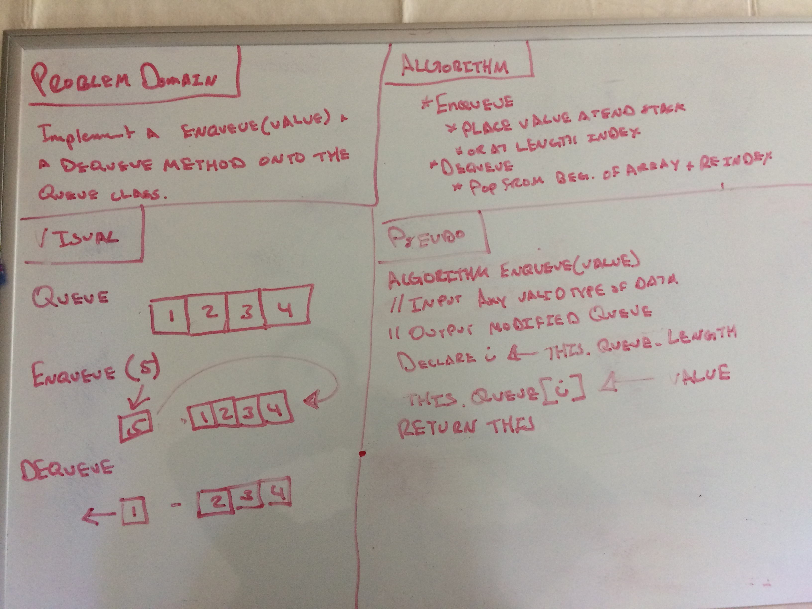

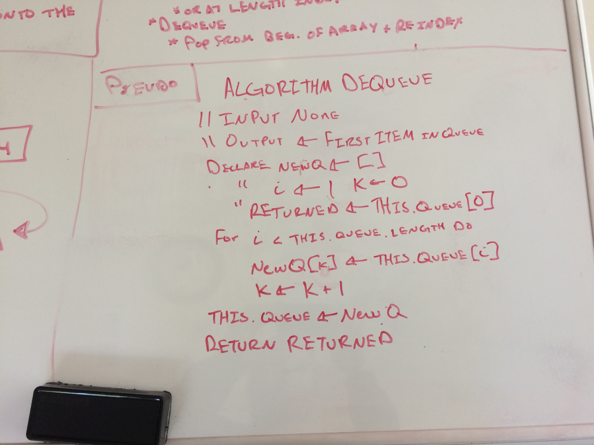

<a id="stacks-queues-challenge2"></a>

### Challenge 02 - FIFO Animal Shelter

Create a class called AnimalShelter which holds only dogs and cats. The shelter operates using a first-in, first-out approach.

Implement the following methods:
* ```enqueue(animal)```: adds animal to the shelter. animal can be either a dog or a cat object.
* ```dequeue(pref)```: returns either a dog or a cat. If pref, a string, is ‘cat’ return the longest-waiting cat. If pref is ‘dog’, return the longest-waiting dog. For anything else, return either a cat or a dog.

#### Solution 

The module is located in 'challenge-02' of the 'stacks-and-queues' directory. 

In order to use, you must import the ```animal.js```, which contains an animal constructor, and ```fifo_animal_shelter.js```, which contains the shelter class and its method. 

These both reside in the same 'challenge-02' directory.

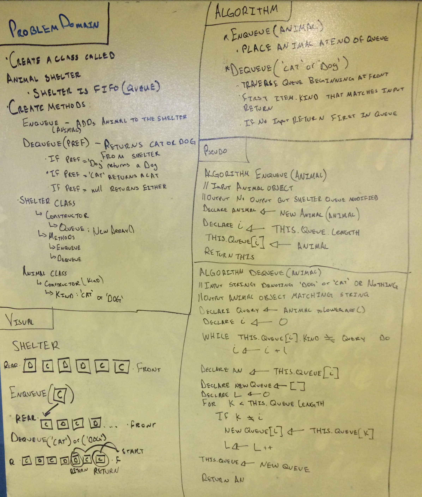

<a id="stacks-queues-challenge3"></a>

### Challenge 03 - Multi Bracket Validation

Your function should take a string as its only argument, and should return a boolean representing whether or not the brackets in the string are balanced. There are 3 types of brackets:

* Round Brackets : ```()```
* Square Brackets : ```[]```
* Curly Brackets : ```{}```

#### Solution 

The module is located in 'challenge 3' of the 'stacks and queues' directory. 

In order to use, you just have to require the module located at `./lib/stacks-and-queues/challenge-03/multi_bracket_validation.js`.


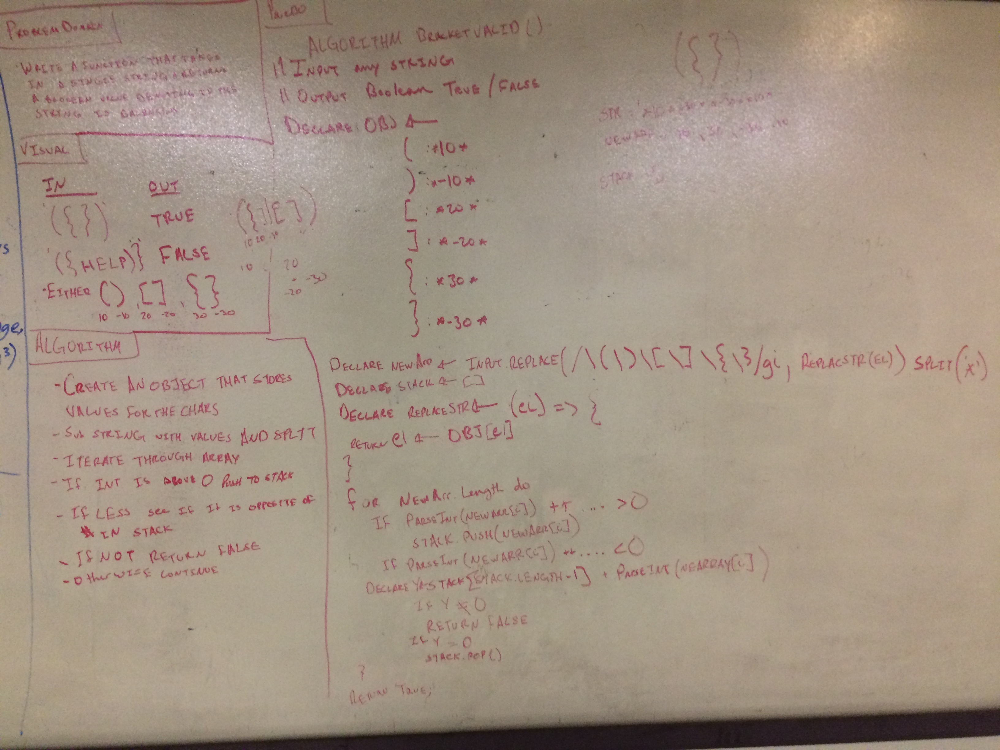

<a id="stacks-queues-challenge4"></a>

### Challenge 04 - Towers of Hanoi

The Towers of Hanoi is a mathematical puzzle where you have 3 towers and N disks of different sizes. The puzzle starts with the disks sorted (i.e. smaller disks sits on top of larger disks) on the left-most tower, and the objective of the puzzle is to move the disks to the right-most tower with the following restrictions:

* Only one disk can be moved at a given time.
* A disk is moved from the top of a tower to the top of another tower.
* A disk can’t be placed on top of a smaller disk.

#### Solution 

The module is located in 'challenge 4' of the 'stacks and queues' directory. 

In order to use, you just have to require the module located at `./lib/stacks-and-queues/challenge-04/towers-of-hanoi.js`.


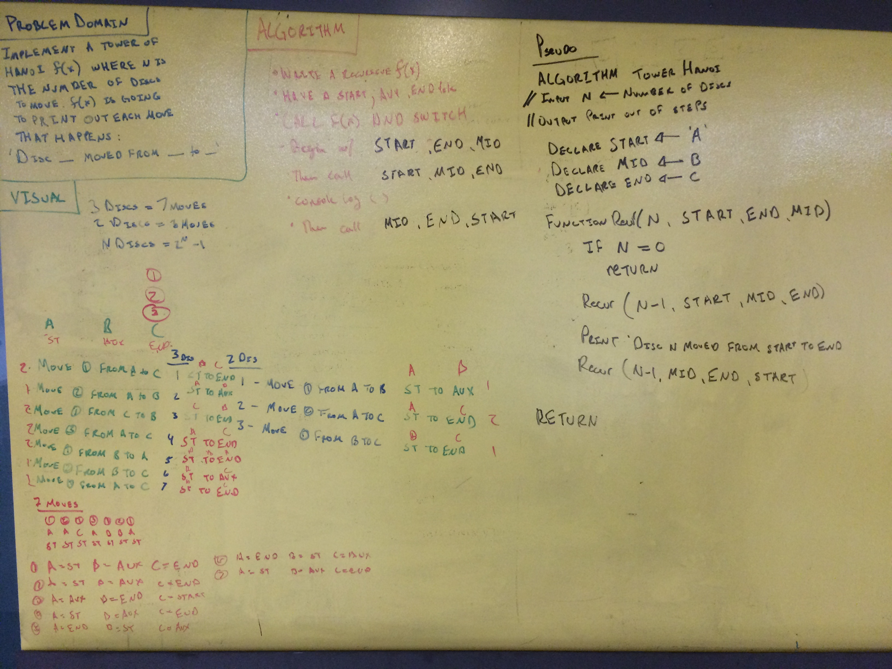

<a id="binary-trees"></a>

Binary Trees
=================

## Documentation

This ```Binary Tree``` module is contained in ```./lib/tree/lib/binary_tree.js```. 

In order to use you must require the above file and also the Node constructor in the same directory (`./lib/tree/lib/node.js`).

<a id="binary-tree-methods"></a>

This `Binary Tree` module contains the following methods for this data structure: 

  * `inOrder()`

`inOrder();`
============

The `inOrder()` traverses the tree in an 'in order' fashion. It Traverse the left subtree by recursively calling the in-order function and then traverses the right subtree recursively.

For Example: 

```
  const BinaryTree = require('/lib/trees/lib/binary_tree.js');
  const Node = require('/lib/trees/lib/node.js');

  const f = new Node('F');
  const b = new Node('B');
  const g = new Node('G');
  const d = new Node('D');
  const i = new Node('I');
  const a = new Node('A');
  const e = new Node('E');
  const c = new Node('C');
  const h = new Node('H');

  const tree = new BinaryTree(f); // Initialize Tree with Root Node

  f.right = b; 
  b.right = g;
  g.right = d;
  d.right = i;
  i.right = a;
  a.right = e;
  e.right = c;
  c.right = h;

  tree.inOrder(); // returns A,B,C,D,E,F,G,H,I
```

<a id="tree-challenges"></a>

Challenges
==========
    
<a id="tree-challenge1"></a>

### Challenge 1 - A Fizz Buzz Tree

Write a function that takes in a tree and changes the values divisble by `3` to `Fizz`, `5` to `Buzz` and by both to `FizzBuzz`.

#### Solution

The module is located in 'challenge-01' directory in './lib/trees/'. 

To use the module you will also need to require in the Node Module (./lib/trees/node.js) and the Binary Tree Module (./lib/trees/binary_tree.js);

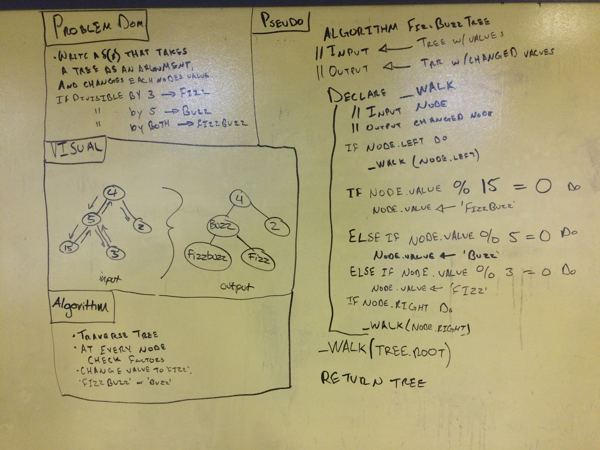

<a id="tree-challenge2"></a>

### Challenge 2 - Breadth First Traversal

Write a function called breadthFirstTraversal which takes a Binary Tree as its unique input. Without utilizing any of the built-in methods available to your language, traverse the input tree using a Breadth-first approach; print every visited node’s value.

#### Solution

The Module is located in 'challenge-02' directory in './lib/trees/'.

To use the module you will need to pass in a tree as an argument and to do that you can use these modules: Node Module (./lib/trees/node.js) and the Binary Tree Module (./lib/trees/binary_tree.js);

[Coded Solution](https://github.com/justeban/data-structures-and-algorithms/blob/master/lib/trees/lib/binary_tree.js)

#### ATTEMPTED WHITEBOARD

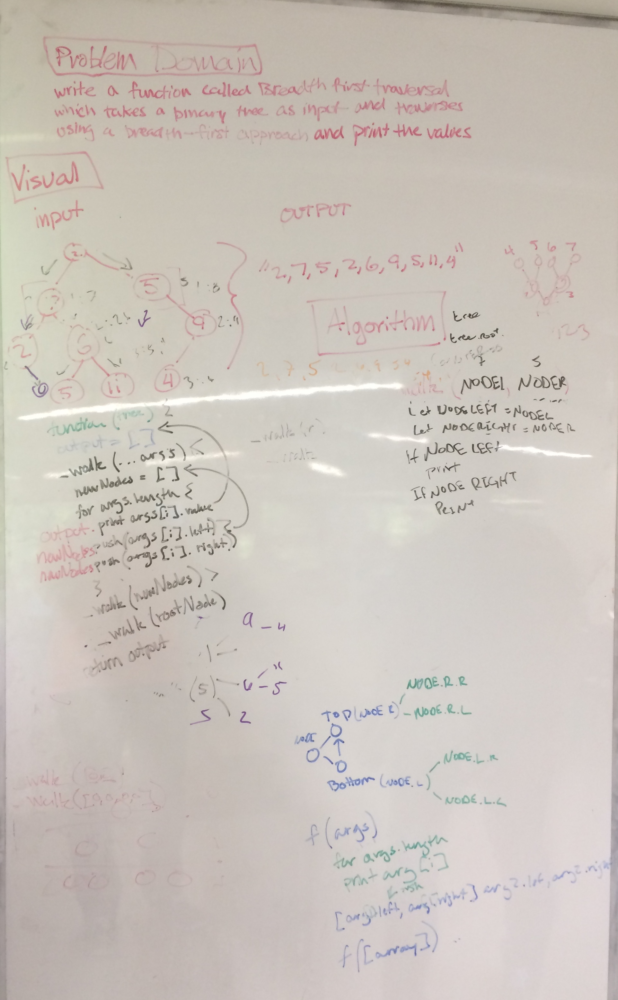
